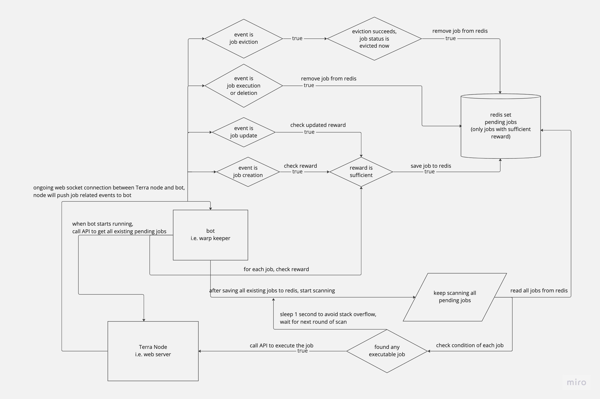

# Overview

## What is [Warp](https://warp.money/)

Warp protocol is an automation protocol for Cosmos, currently live on Terra. It allows anyone to create a job which is composed of 2 parts: a list of messages (could be any cosmos SDK or cosmwasm message) and a condition (from simple expression like after block height reach x to complex SDK or cw query). When the condition of a job is met, anyone can submit a transaction to execute the job.

### What is a warp keeper

Warp keeper is a solution to find the executable or evictable jobs in warp and execute or evict them.

### What is eviction

A job can be evicted if it's been in the pending set after a certain period of time (1 day in current setting), anyone can try to evict a job and result it in either evicted status or pending status. If the job owner set job's `enqueue_on_evict` property to true and has enough balance (0.01 LUNA in current setting), eviction will result the job in pending status, essentially job creator spent 0.01 LUNA to keep the job alive, if not eviction will result the job in evicted status, basically dead from keeper's perspective. This eviction mechanism acts as a state rent, i.e. job creator needs to pay to keep job alive so we won't infinite jobs pending and making keeper querying everything hard.

## How does the keeper work

You can refer to the flow chat above, on a high level, we have 3 bots running together, read and write to some redis sets.

### Redis

We have 3 major redis set. We only use non duplicate data structure like set and map to make sure even if we add duplicate there won't be any issue.

- `REDIS_PENDING_JOB_ID_SET` holds all pending jobs.
- `REDIS_EXECUTABLE_JOB_ID_SET` holds all executable jobs.
- `REDIS_EVICTABLE_JOB_ID_SET` holds all evictable jobs.

### Collector

Collector will first query warp contract to save all existing jobs to redis pending set, then it opens a websocket connection to the Terra full node to process below types of event.

- `create_job`: a new job is created, we will save it into our set.
- `update_job`: an existing job is updated (now only supports updating name or reward), we will update it in our set.
- `execute_job`: a pending job is executed, we will delete it from all sets.
- `evict_job`: a pending job is evicted, we will check its new status, if it's pending we add it to our set, if it's evicted we delete from all sets.
- `delete_job`: a pending job is delete, we will delete it from all sets.
- `recur_job`: a pending job is executed, but the job is recurring, we will check its new status, if succeeds we save to pending set, otherwise delete from all sets.

### Monitor

Monitor will keep scanning all jobs in the pending set and check if it becomes executable or evictable, if so add it to corresponding set.

### Executor

Executor will keep scanning all jobs in the executable set and execute them, and evictable set and evict them.
