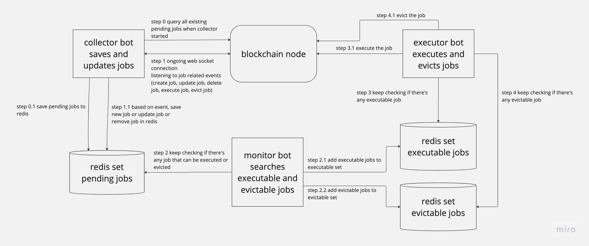

# warp-keeper

## Overview

Warp keeper is essentially a set of bots that monitor the jobs in warp protocol and execute or evict them when certain conditions are met.

For a detailed overview on what is warp and how does the keeper work, please refer to the [overview doc](OVERVIEW.MD).

## Usage

1. Start your own Terra full node or have access to a remote one, it is highly recommended to run your own node to minimize latency as the job is executed in a first come first win manner.
2. Create a `.env` file, copy the content from `.example.env`, `MNEMONIC_KEY` is the key that holds fund for the keeper. You can enter your [sentry](https://sentry.io/) key to receive alert when the bot crash, you can also enable [skip](https://skip.money/) to bid your execution / eviction tx.
3. Create a warp account, you can do it on the UI by following the [guide](https://docs.warp.money/get-started). You can also create it by running `yarn create-account`, but you need to set `TESTER_MNEMONIC_KEY` in `.env` as well cause these scripts are meant for testing originally.
4. Start docker, then run `yarn start-warp-keeper-in-docker`, this will run everything (redis, collector, monitor and executor) in docker.
5. Congrats! You are doing your part to make Warp protocol awesome! Watch out for any email alert from sentry in case the bot crash.

## Caution

Although this bot should be working at this point, I'm still tuning it to add proper error handling and try to make it more efficient and profitable.

Feel free to reach me on [twitter](https://twitter.com/llllllluuc) for any questions or feedbacks.
